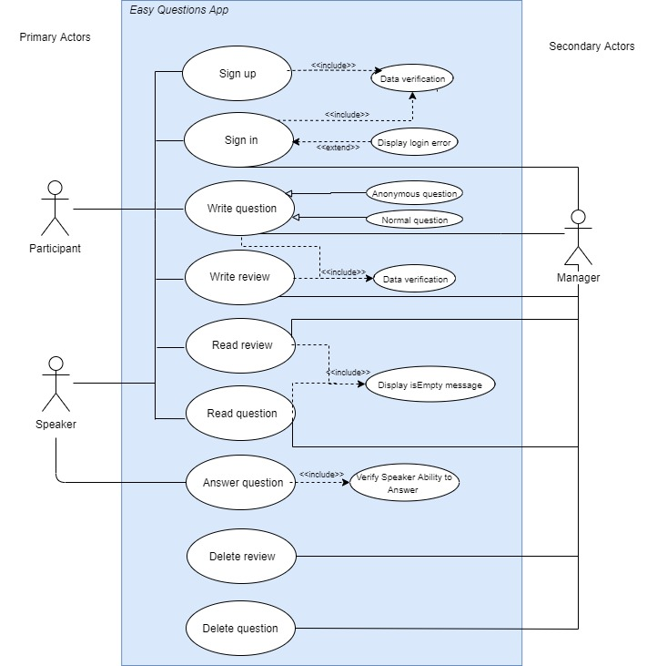
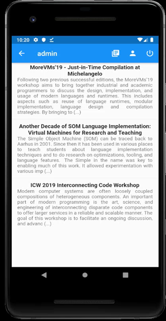
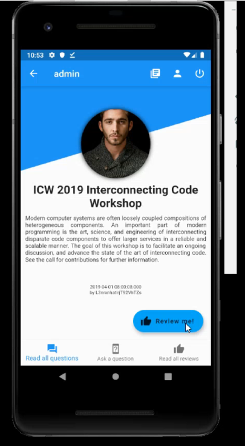
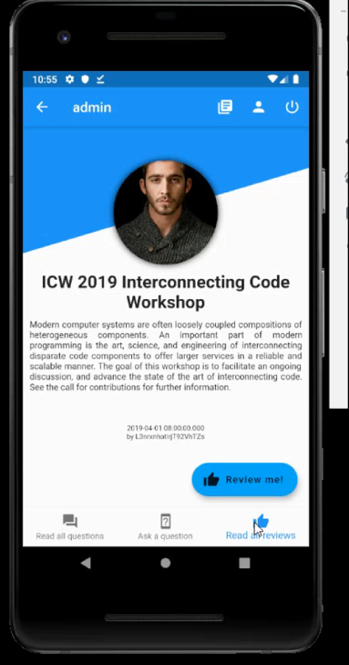
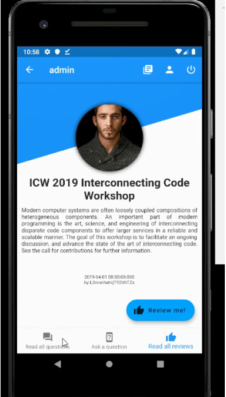
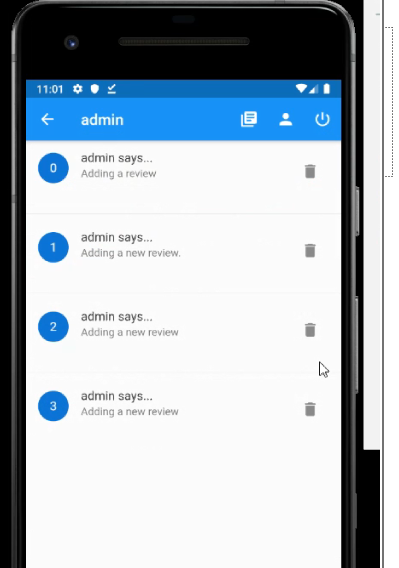
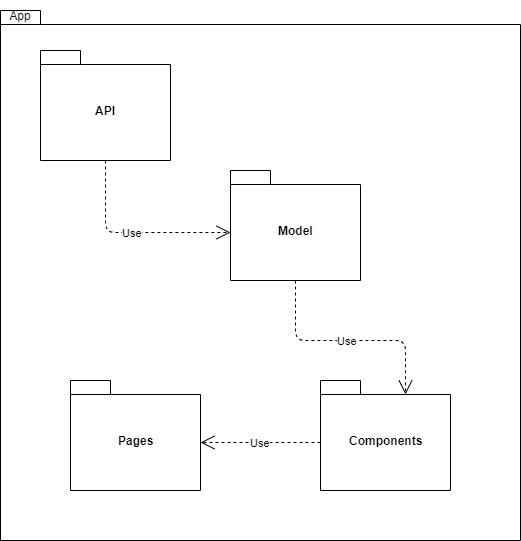
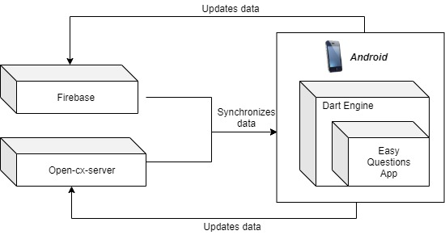

# openCX-*Easy Questions* Development Report

Welcome to the documentation pages of the *Easy Questions* of **openCX**!

You can find here detailed information about the (sub)product, hereby mentioned as module, from a high-level vision to low-level implementation decisions, a kind of Software Development Report (see [template](https://github.com/softeng-feup/open-cx/blob/master/docs/templates/Development-Report.md)), organized by discipline (as of RUP): 

* Business modeling 
  * [Product Vision](#Product-Vision)
  * [Elevator Pitch](#Elevator-Pitch)
* Requirements
  * [Use Case Diagram](#Use-case-diagram)
  * [User stories](#User-stories)
  * [Domain model](#Domain-model)
* Architecture and Design
  * [Logical architecture](#Logical-architecture)
  * [Physical architecture](#Physical-architecture)
  * [Prototype](#Prototype)
* [Implementation](#Implementation)
* [Test](#Test)
* [Configuration and change management](#Configuration-and-change-management)
* [Project management](#Project-management)

So far, contributions are exclusively made by the initial team, but we hope to open them to the community, in all areas and topics: requirements, technologies, development, experimentation, testing, etc.

Please contact us! 

Thank you!

# Business Modeling

## Product Vision
A aplicação procura estimular a relação participante-orador, facilitando a colocação de perguntas durante uma palestra. Estas podem ser anónimas ou não e feitas durante ou após o evento. O moderador pode selecionar as perguntas mais interessantes no momento, passando-as ao orador que lhes dará resposta; as restantes perguntas estarão disponíveis da página do orador e, quando respondidas, ficarão disponíveis para todos.
Para além disso, a aplicação permite que os participantes expressem a sua opinião, avaliando o funcionamento da conferência, a prestação de um orador, entre outros. Cada orador tem acesso às suas avaliações e a organização terá acesso a todas com o objetivo de aprimorar futuros eventos.
A aplicação está disponível para Android e o link para download deverá ser fornecido pelos organizadores.

## Elevator Pitch
Alguma vez sentiu que, na sua conferência, não foram colocadas questões suficientes ao orador? Somos a equipa da Easy Questions. Com a nossa aplicação os participantes podem esclarecer todas as suas dúvidas, anonimamente ou não, durante ou depois de uma apresentação. Por outro lado, gostaria de receber o feedback dos seus participantes? Esta aplicação permite que a sua voz seja ouvida contribuindo para melhorias na organização de futuros eventos. 

# Requirements

### Use case diagram 

#### Sign up
* **Actor**
Speaker e Participant

* **Description**
O utilizador cria uma conta na aplicação.

* **Preconditions and Postconditions **
Depois de criar a conta, o utilizador pode efetua o login para aceder à aplicação e todos os seus conteúdos.

* **Normal Flow**
1) Preenche todos os campos do registo (é feita uma verificação para garantir que 2 utilizadores não tenham as mesmas credênciais)
2) Pressiona o botão 'REGISTER'
3) É redirecionado para a página de boas-vindas, onde poderá prodeceder ao login.

* **Alternative Flows and Exceptions**.
O utilizador não consegue fazer o registo (as credências estão a ser utilizadas ou há campos vazios): aparece uma mensagem de aviso que indica quais os campos em falha.

#### Sign in
* **Actor**
Speaker, Participant, Manager

* **Description**. 
O utilizador inicia sessão na aplicação.

* **Preconditions and Postconditions**. 
O utilizador deve ter efetuado um registo anteriormente. Depois de iniciar sessão corretamente, o utilizador pode aceder à aplicação e todos os seus conteúdos.

* **Normal Flow**. 
1) Preenche, corretamente, os campos email e password.
2) Pressiona o botão 'LOGIN'.
3) É redirecionado para a página com a listagem de todas as Talks, podendo interagir com a aplicação.

* **Alternative Flows and Exceptions**.
O utilizador não consegue efetuar o login (os dados estão errados): podem escolher a opção 'Recuperar password' - o Firebase envia um email para recuperar password.

#### Write Question & Review
* **Actor**
Speaker, Participant, Manager

* **Description**. 
O utilizador pode escrever as suas questões (anónimas ou não) ou reviews, em relação a uma Talk.

* **Preconditions and Postconditions**. 
O utilizador deve ter efetuado o login com sucesso e selecionado uma Talk em concreto.

* **Normal Flow**. 
1) Seleciona uma Talk.
2) Pressiona o botão 'Write Question' (para questões) ou 'Review Me!' (para reviews).
3) É redirecionado para uma página onde pode escrever a sua questão(com uma checkbox onde especifica se é anónima ou não)/review.
4) Após escrever, pressiona o botão 'SUBMIT' para que os dados sejam adicionados à Talk.

* **Alternative Flows and Exceptions**.
Mensagens vazias não são permitidas: o utilizador mantém-se na mesma página até que pressione um botão para sair ou escreva algum texto.

#### Read Question & Review
* **Actor**
Speaker, Participant, Manager

* **Description**. 
O utilizador pode ler todas as questões (anónimas ou não) ou reviews, em relação a uma Talk.

* **Preconditions and Postconditions**. 
O utilizador deve ter efetuado o login com sucesso e selecionado uma Talk em concreto.

* **Normal Flow**. 
1) Seleciona uma Talk.
2) Pressiona o botão 'Read all questions' (para questões) ou 'Read all reviews' (para reviews).
3) É redirecionado para uma página com uma listagem de todas as questões / reviews.

* **Alternative Flows and Exceptions**.
Se uma Talk não tiver reviews ou questões, será exibida uma página de erro.

#### Answer question
* **Actor**
Speaker

* **Description**. 
O utilizador pode responder às questões que lhe forem direcionadas (só o Speaker da Talk pode responder às questões dessa mesma Talk).

* **Preconditions and Postconditions**. 
O utilizador deverá apenas responder às questões que estão associadas à sua Talk.

* **Normal Flow**. 
1) Seleciona uma Talk.
2) Pressiona o botão 'Read all questions'.
3) Seleciona uma pergunta para responder.
4) Escreve a sua resposta.
5) Pressiona o botão 'SUBMIT'

* **Alternative Flows and Exceptions**.
Mensagens vazias não são permitidas: o utilizador mantém-se na mesma página até que pressione um botão para sair ou escreva algum texto.

#### Delete Question & Review
* **Actor**
Manager

* **Description**. 
O utilizador pode eliminar questões ou reviews que não sejam oportunas ou que estejam repetidas.

* **Normal Flow**. 
1) Seleciona uma Talk.
2) Pressiona o botão 'Read all questions'.
3) Seleciona uma pergunta para eliminar.
4) Confirma a sua decisão.

* **Alternative Flows and Exceptions**.
Se uma Talk não tiver reviews ou questões, será exibida uma página de erro, pelo que o Manager não pode eliminar nada.

### User stories
Todas as user stories podem ser encontradas no [Trello](https://trello.com/b/OYwLccwN/easyquestions), com mais detalhes, incluindo os ACCEPTANCE TESTS e VALUE & EFFORT. 

* **Como utilizador, quero ter acesso à lista de eventos**
Seja como participante, orador ou manager quero ter acesso à lista de eventos, assim como às suas respetivas informações (local, hora).

* **Como utilizador quero avaliar**
Seja como participante, orador ou manager quero escrever avaliações em relação a um evento, promovendo a sua melhoria.

* **Como orador quero ler avaliaçoes**
Como orador, quero ler as avaliações da minha sessão, de forma a melhorar as minhas conferências.

* **Como participante, quero escrever questões**
Como participante quero escrever questões ao orador, anónimas ou não, para esclarecer as minhas dúvidas sobre a sessão.

* **Como orador, quero ler questões**
Como orador, quero ler as questões sobre a minha conferência no fim da mesma, para poder dar respostas às perguntas não abordadas durante a sessão.

* **Como manager, quero apagar questões**
Como manager, quero poder apagar questões, pois podem ser repetidas ou despropositadas.

* **Como manager, quero apagar avaliações**
Como manager, quero poder apagar avaliações, pois podem ser repetidas ou despropositadas.

### Domain model

O nosso domain model segue a estrutura definida em [Model](App/lib/Model), onde se distinguem User, Question, Review e Talk. 

# Architecture and Design
### Logical architecture
Desde o inicio que tentamos estruturar bem toda a nossa aplicação. Seguimos o modelo MVC (Model View Controller) o que permitiu um desenvolvimento rápido da aplicação, assim como permitirá uma melhor manutenção e escabilidade do mesmo. Deste modo, o código divide-se em:

- API (= Controller): permite à aplicação obter todos os dados que precisa das bases de dados;
- Model: contem as estruturas para todos os nossos dados (Question, Review, Talk, User);
- Components (= View): contem widgets que são "constantes" para toda a aplicacão, como a top bar, mensagens de erro, etc.
- Pages (= View): interface para o utilizador.

### Physical architecture

Começamos por desevolver a nossa aplicação recorrendo ao Firebase. BaaS ou BackEnd As A Service (MBaaS = Mobile BackEnd As A Service) é um serviço disponibilizado pelo Firebase em que toda a estrutura do backend como configuração de servidor, integração com a base de dados, sistema de push notification, etc., estão completamente prontos para se integrados com a aplicação. O Firebase permite ainda guardar binary files (tal como imagens), na Google Cloud Storage, úteis para armazenar os avatares dos nossos utilizadores. Utilizamos ainda o Firebase Authentication uma vez que possui um sistema de autenticação email/password (que pode ser estendido para contas de Gmail, Facebook, Github, etc.) já integrado que facilita todo o processamento/armazenamento de dados mais sensíveis (como passwords).
No final do desenvolvimento da aplicação decidimos também utilizar o Open-cx-server exclusivamente para as Reviews.

Relativamente à framework utilizada, recorremos ao Flutter por sugestão dos docentes da disciplina. 

### Prototype
Todas as funcionalidades da nossa aplicação podem ser vistas no nosso [powerpoint](Presentation/Presentation.pptx), que descreve as user stories e possui um vídeo de demonstração das mesmas.

# Implementation
A aplicação contou com 5 iterações:
1) Dedicou-se algum tempo a aprender a Flutter/Dart; desevolveu-se a estrutura das páginas de login, registo e home (sem qualquer backend);
2) Dedicou-se algum tempo a compreender o Firebase e a sua estrutura, assim como a conectar a aplicação ao mesmo. Desenvolveu-se a página das Talks. Páginas de autenticação e registo já com backend.
3) Desevolveram-se as restantes páginas.
4) Alteração do Model/Review para se melhor ajustar ao open-cx-server; corrigiram-se alguns bugs.
5) Integração do open-cx-server na aplicação; desenvolveram-se alguns testes; finalizou-se o relatório.

# Test
Para assegurar a qualidade das features desenvolvidas, testaram-se:

> Sign-in : verificar se os dados foram colocados corretamente.
> Question and Reviews: verificar se o utilizador pode fazer reviews/questions.
> Profile : verificar se o utilizador consegue fazer update de todas as informacoes

Os acceptance tests estão descritos no [Trello](https://trello.com/b/OYwLccwN/easyquestions), para cada user story.

# Project management
Para a gestão do projeto recorremos ao [Trello](https://trello.com/b/OYwLccwN/easyquestions) e ao [Github](https://github.com/softeng-feup/open-cx-easyquestions).
