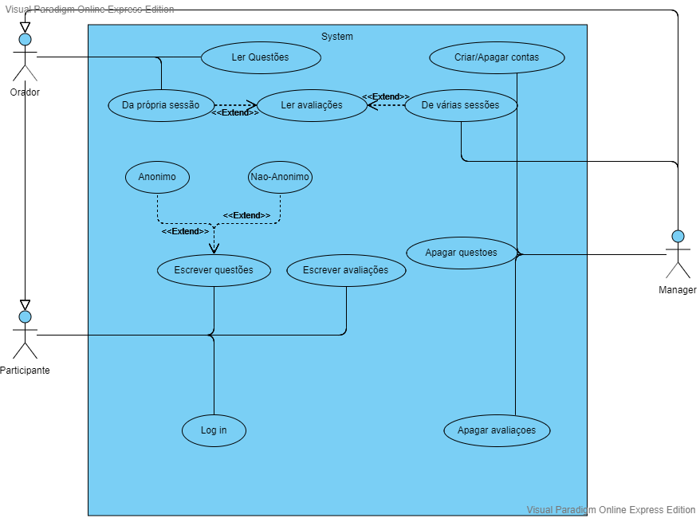
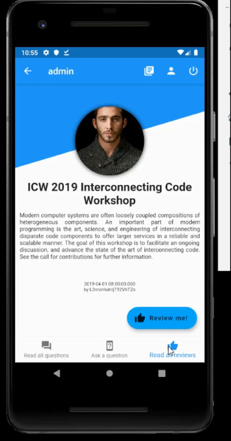
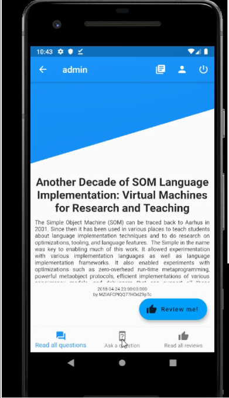
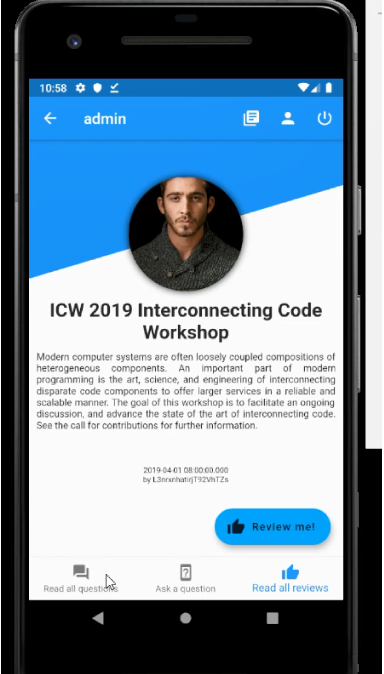
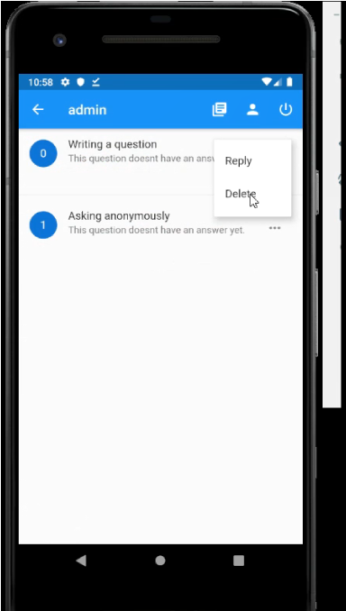
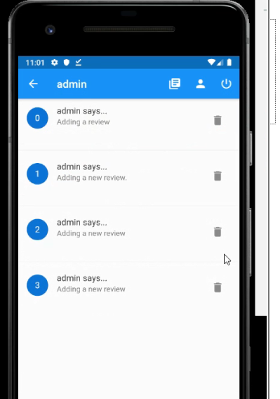

# openCX-*Easy Questions* Development Report

Welcome to the documentation pages of the *Easy Questions* of **openCX**!

You can find here detailed information about the (sub)product, hereby mentioned as module, from a high-level vision to low-level implementation decisions, a kind of Software Development Report (see [template](https://github.com/softeng-feup/open-cx/blob/master/docs/templates/Development-Report.md)), organized by discipline (as of RUP): 

* Business modeling 
  * [Product Vision](#Product-Vision)
  * [Elevator Pitch](#Elevator-Pitch)
* Requirements
  * [Use Case Diagram](#Use-case-diagram)
  * [User stories](#User-stories)
  * [Domain model](#Domain-model)
* Architecture and Design
  * [Architectural and design decisions]()
  * [Technological architecture]()
  * [Logical architecture]()
* Implementation
  * [Source code]()
  * [Issues](): feature requests, bug fixes, improvements.
* Test
  * [Automated tests](): Functional tests, integration tests, acceptance tests, as much automated as possible.
* Change management
  * [Issues at Github]()
* Project management
  * Tasks management tool 

So far, contributions are exclusively made by the initial team, but we hope to open them to the community, in all areas and topics: requirements, technologies, development, experimentation, testing, etc.

Please contact us! 

Thank you!

## Product Vision
A aplicação procura estimular a relação participante-orador, facilitando a colocação de perguntas durante uma palestra. Estas podem ser anónimas ou não e feitas durante ou após o evento. O moderador pode selecionar as perguntas mais interessantes no momento, passando-as ao orador que lhes dará resposta; as restantes perguntas estarão disponíveis da página do orador e, quando respondidas, ficarão disponíveis para todos.
Para além disso, a aplicação permite que os participantes expressem a sua opinião, avaliando o funcionamento da conferência, a prestação de um orador, entre outros. Cada orador tem acesso às suas avaliações e a organização terá acesso a todas com o objetivo de aprimorar futuros eventos.
A aplicação está disponível para Android e o link para download deverá ser fornecido pelos organizadores.

## Elevator Pitch
Alguma vez sentiu que, na sua conferência, não foram colocadas questões suficientes ao orador? Somos a equipa da Easy Questions. Com a nossa aplicação os participantes podem esclarecer todas as suas dúvidas, anonimamente ou não, durante ou depois de uma apresentação. Por outro lado, gostaria de receber o feedback dos seus participantes? Esta aplicação permite que a sua voz seja ouvida contribuindo para melhorias na organização de futuros eventos. 

## Requirements

### Use case diagram 

* **Actor**. 
1) Orador: representa um orador na conferência 
2) Participante: representa um participante na conferência (utilizador com menos privilegios)
3) Manager: representa a organização da conferência (utilizador com mais privilégios)

* **Description**. 
Caso seja responder a uma pergunta, fazê-la ou avaliar uma sessão, tudo é possível através da aplicação.

* **Preconditions and Postconditions**. 
Tanto o Participante como o Orador devem registar-se na aplicação para poderem colocar/ler questões ou avaliações.

* **Normal Flow**. 
Utilizador: Efetua o login; seleciona o orador que quer avaliar/colocar questões; efetua a sua avaliação/questão.
Efetua o login; seleciona a página de avaliações; escreve a sua avaliação.
Orador: Efetua o login, abre a sua página de questões; responde às questões.
Manager: Pode apagar questões ou avaliações; lê as avaliações.

* **Alternative Flows and Exceptions**.
O participante ou o orador não conseguem efetuar o login (os dados estão errados): são reencaminhados para uma página de recuperação de dados. Tentam efetuar o login posteriormente.

### User stories

* **Como utilizador, quero ter acesso à lista de eventos**
Seja como participante, orador ou manager quero ter acesso à lista de eventos, assim como às suas respetivas informações (local, hora).

* **Como utilizador quero avaliar**
Seja como participante, orador ou manager quero escrever avaliações em relação a um evento, promovendo a sua melhoria.

* **Como orador quero ler avaliaçoes**
Como orador, quero ler as avaliações da minha sessão, de forma a melhorar as minhas conferências.

* **Como participante, quero escrever questões**
Como participante quero escrever questões ao orador, anónimas ou não, para esclarecer as minhas dúvidas sobre a sessão.

* **Como orador, quero ler questões**
Como orador, quero ler as questões sobre a minha conferência no fim da mesma, para poder dar respostas às perguntas não abordadas durante a sessão.

* **Como manager, quero apagar questões**
Como manager, quero poder apagar questões, pois podem ser repetidas ou despropositadas.

* **Como manager, quero apagar avaliações**
Como manager, quero poder apagar avaliações, pois podem ser repetidas ou despropositadas.

### Domain model
A simple UML class diagram with all the key concepts (names, attributes) and relationships involved of the problem domain addressed by your module.

