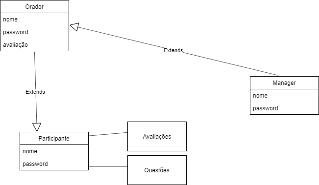

# openCX-*Easy Questions* Development Report

Welcome to the documentation pages of the *Easy Questions* of **openCX**!

You can find here detailed information about the (sub)product, hereby mentioned as module, from a high-level vision to low-level implementation decisions, a kind of Software Development Report (see [template](https://github.com/softeng-feup/open-cx/blob/master/docs/templates/Development-Report.md)), organized by discipline (as of RUP): 

* Business modeling 
  * [Product Vision](#Product-Vision)
  * [Elevator Pitch](#Elevator-Pitch)
* Requirements
  * [Use Case Diagram](#Use-case-diagram)
  * [User stories](#User-stories)
  * [Domain model](#Domain-model)
* Architecture and Design
  * [Architectural and design decisions]()
  * [Technological architecture]()
  * [Logical architecture]()
* Implementation
  * [Source code]()
  * [Issues](): feature requests, bug fixes, improvements.
* Test
  * [Automated tests](): Functional tests, integration tests, acceptance tests, as much automated as possible.
* Change management
  * [Issues at Github]()
* Project management
  * Tasks management tool 

So far, contributions are exclusively made by the initial team, but we hope to open them to the community, in all areas and topics: requirements, technologies, development, experimentation, testing, etc.

Please contact us! 

Thank you!

## Product Vision
A aplicação procura estimular a relação participante-orador, facilitando a colocação de perguntas durante uma palestra. Estas podem ser anónimas ou não e feitas durante ou após o evento. O moderador pode selecionar as perguntas mais interessantes no momento, passando-as ao orador que lhes dará resposta; as restantes perguntas estarão disponíveis da página do orador e, quando respondidas, ficarão disponíveis para todos.
Para além disso, a aplicação permite que os participantes expressem a sua opinião, avaliando o funcionamento da conferência, a prestação de um orador, entre outros. Cada orador tem acesso às suas avaliações e a organização terá acesso a todas com o objetivo de aprimorar futuros eventos.
A aplicação está disponível para Android e o link para download deverá ser fornecido pelos organizadores.

## Elevator Pitch
Alguma vez sentiu que, na sua conferência, não foram colocadas questões suficientes ao orador? Somos a equipa da Easy Questions. Com a nossa aplicação os participantes podem esclarecer todas as suas dúvidas, anonimamente ou não, durante ou depois de uma apresentação. Por outro lado, gostaria de receber o feedback dos seus participantes? Esta aplicação permite que a sua voz seja ouvida contribuindo para melhorias na organização de futuros eventos. 

## Requirements

### Use case diagram 

#### Sign up
* **Actor**
Speaker e Participant

* **Description**
O utilizador cria uma conta na aplicação.

* **Preconditions and Postconditions **
Depois de criar a conta, o utilizador pode efetua o login para aceder à aplicação e todos os seus conteúdos.

* **Normal Flow**
1) Preenche todos os campos do registo (é feita uma verificação para garantir que 2 utilizadores não tenham as mesmas credênciais)
2) Pressiona o botão 'REGISTER'
3) É redirecionado para a página de boas-vindas, onde poderá prodeceder ao login.

* **Alternative Flows and Exceptions**.
O utilizador não consegue fazer o registo (as credências estão a ser utilizadas ou há campos vazios): aparece uma mensagem de aviso que indica quais os campos em falha.

#### Sign in
* **Actor**
Speaker, Participant, Manager

* **Description**. 
O utilizador inicia sessão na aplicação.

* **Preconditions and Postconditions**. 
O utilizador deve ter efetuado um registo anteriormente. Depois de iniciar sessão corretamente, o utilizador pode aceder à aplicação e todos os seus conteúdos.

* **Normal Flow**. 
1) Preenche, corretamente, os campos email e password.
2) Pressiona o botão 'LOGIN'.
3) É redirecionado para a página com a listagem de todas as Talks, podendo interagir com a aplicação.

* **Alternative Flows and Exceptions**.
O utilizador não consegue efetuar o login (os dados estão errados): podem escolher a opção 'Recuperar password' - o Firebase envia um email para recuperar password.

#### Write Question & Review
* **Actor**
Speaker, Participant, Manager

* **Description**. 
O utilizador pode escrever as suas questões (anónimas ou não) ou reviews, em relação a uma Talk.

* **Preconditions and Postconditions**. 
O utilizador deve ter efetuado o login com sucesso e selecionado uma Talk em concreto.

* **Normal Flow**. 
1) Seleciona uma Talk.
2) Pressiona o botão 'Write Question' (para questões) ou 'Review Me!' (para reviews).
3) É redirecionado para uma página onde pode escrever a sua questão(com uma checkbox onde especifica se é anónima ou não)/review.
4) Após escrever, pressiona o botão 'SUBMIT' para que os dados sejam adicionados à Talk.

* **Alternative Flows and Exceptions**.
Mensagens vazias não são permitidas: o utilizador mantém-se na mesma página até que pressione um botão para sair ou escreva algum texto.

### Read Question & Review
* **Actor**
Speaker, Participant, Manager

* **Description**. 
O utilizador pode ler todas as questões (anónimas ou não) ou reviews, em relação a uma Talk.

* **Preconditions and Postconditions**. 
O utilizador deve ter efetuado o login com sucesso e selecionado uma Talk em concreto.

* **Normal Flow**. 
1) Seleciona uma Talk.
2) Pressiona o botão 'Read all questions' (para questões) ou 'Read all reviews' (para reviews).
3) É redirecionado para uma página com uma listagem de todas as questões / reviews.

* **Alternative Flows and Exceptions**.
Se uma Talk não tiver reviews ou questões, será exibida uma página de erro.

### Answer question
* **Actor**
Speaker

* **Description**. 
O utilizador pode responder às questões que lhe forem direcionadas (só o Speaker da Talk pode responder às questões dessa mesma Talk).

* **Preconditions and Postconditions**. 
O utilizador deverá apenas responder às questões que estão associadas à sua Talk.

* **Normal Flow**. 
1) Seleciona uma Talk.
2) Pressiona o botão 'Read all questions'.
3) Seleciona uma pergunta para responder.
4) Escreve a sua resposta.
5) Pressiona o botão 'SUBMIT'

* **Alternative Flows and Exceptions**.
Mensagens vazias não são permitidas: o utilizador mantém-se na mesma página até que pressione um botão para sair ou escreva algum texto.

### Delete Question & Review
* **Actor**
Manager

* **Description**. 
O utilizador pode eliminar questões ou reviews que não sejam oportunas ou que estejam repetidas.

* **Normal Flow**. 
1) Seleciona uma Talk.
2) Pressiona o botão 'Read all questions'.
3) Seleciona uma pergunta para eliminar.
4) Confirma a sua decisão.

* **Alternative Flows and Exceptions**.
Se uma Talk não tiver reviews ou questões, será exibida uma página de erro, pelo que o Manager não pode eliminar nada.

### User stories

* **Como utilizador, quero ter acesso à lista de eventos**
Seja como participante, orador ou manager quero ter acesso à lista de eventos, assim como às suas respetivas informações (local, hora).

* **Como utilizador quero avaliar**
Seja como participante, orador ou manager quero escrever avaliações em relação a um evento, promovendo a sua melhoria.

* **Como orador quero ler avaliaçoes**
Como orador, quero ler as avaliações da minha sessão, de forma a melhorar as minhas conferências.

* **Como participante, quero escrever questões**
Como participante quero escrever questões ao orador, anónimas ou não, para esclarecer as minhas dúvidas sobre a sessão.

* **Como orador, quero ler questões**
Como orador, quero ler as questões sobre a minha conferência no fim da mesma, para poder dar respostas às perguntas não abordadas durante a sessão.

* **Como manager, quero apagar questões**
Como manager, quero poder apagar questões, pois podem ser repetidas ou despropositadas.

* **Como manager, quero apagar avaliações**
Como manager, quero poder apagar avaliações, pois podem ser repetidas ou despropositadas.

### Domain model

## Architecture and Design
The architecture of a software system encompasses the set of key decisions about its overall organization. 

A well written architecture document is brief but reduces the amount of time it takes new programmers to a project to understand the code to feel able to make modifications and enhancements.

To document the architecture requires describing the decomposition of the system in their parts (high-level components) and the key behaviors and collaborations between them. 

In this section you should start by briefly describing the overall components of the project and their interrelations. You should also describe how you solved typical problems you may have encountered, pointing to well-known architectural and design patterns, if applicable.

### Logical architecture
The purpose of this subsection is to document the high-level logical structure of the code, using a UML diagram with logical packages, without the worry of allocating to components, processes or machines.

It can be beneficial to present the system both in a horizontal or vertical decomposition:
* horizontal decomposition may define layers and implementation concepts, such as the user interface, business logic and concepts; 
* vertical decomposition can define a hierarchy of subsystems that cover all layers of implementation.

### Physical architecture

Como backend começamos por desevolver a nossa aplicação recorrendo ao Firebase. BaaS ou BackEnd As A Service (MBaaS = Mobile BackEnd As A Service) é um serviço disponibilizado pelo Firebase em que toda a estrutura do backend como configuração de servidor, integração com a base de dados, sistema de push notification, etc., estão completamente prontos para se integrados com a aplicação. O Firebase permite ainda guardar binary files (tal como imagens), na Google Cloud Storage, úteis para armazenar os avatares dos nossos utilizadores. Utilizamos ainda o Firebase Authentication uma vez que possui um sistema de autenticação email/password (que pode ser estendido para contas de Gmail, Facebook, Github, etc.) já integrado que facilita todo o processamento/armazenamento de dados mais sensíveis (como passwords).
No final do desenvolvimento da aplicação decidimos também utilizar o Open-cx-server exclusivamente para as Reviews.

Relativamente à framework utilizada, recorremos ao Flutter por sugestão dos docentes da disciplina. 

### Prototype
To help on validating all the architectural, design and technological decisions made, we usually implement a vertical prototype, a thin vertical slice of the system.

In this subsection please describe in more detail which, and how, user(s) story(ies) were implemented.

